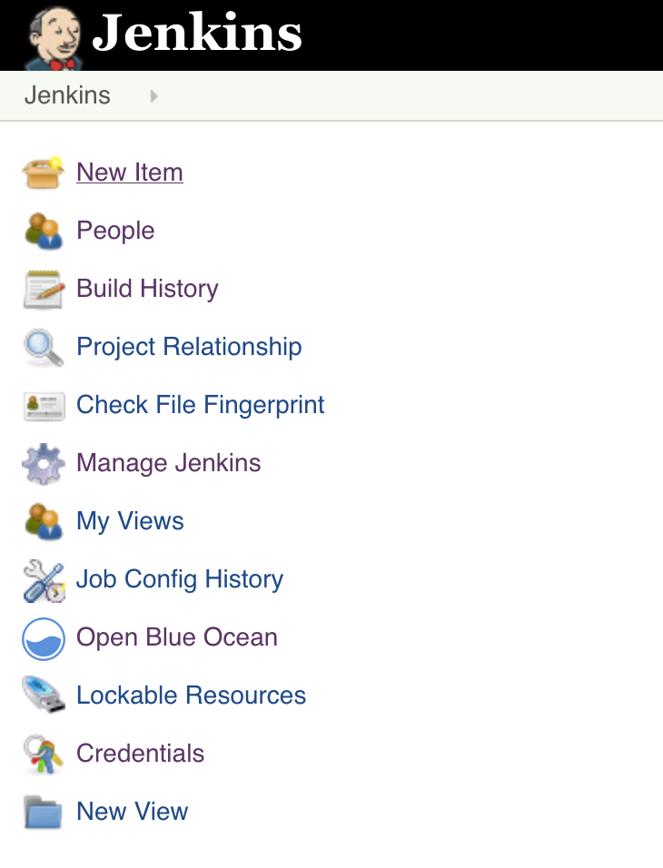
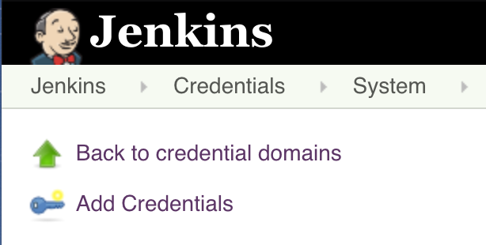
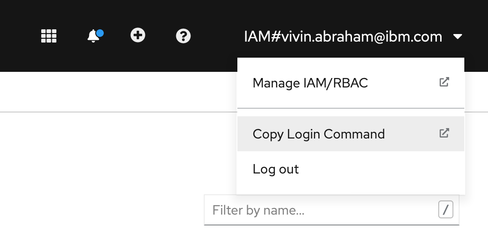
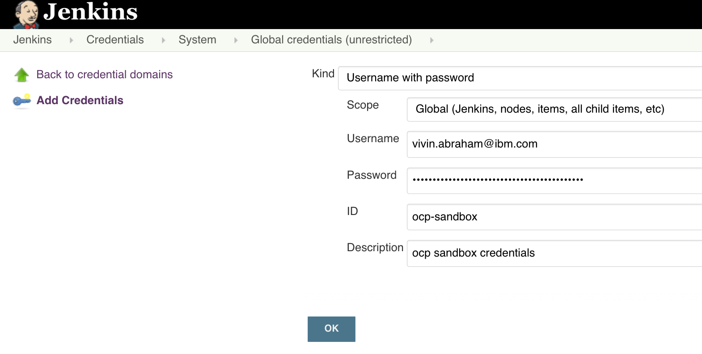
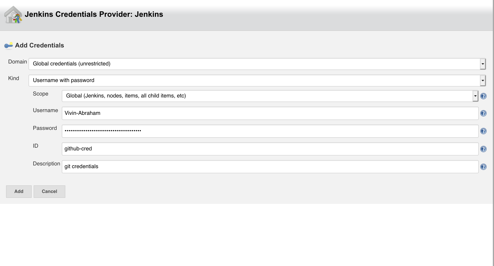
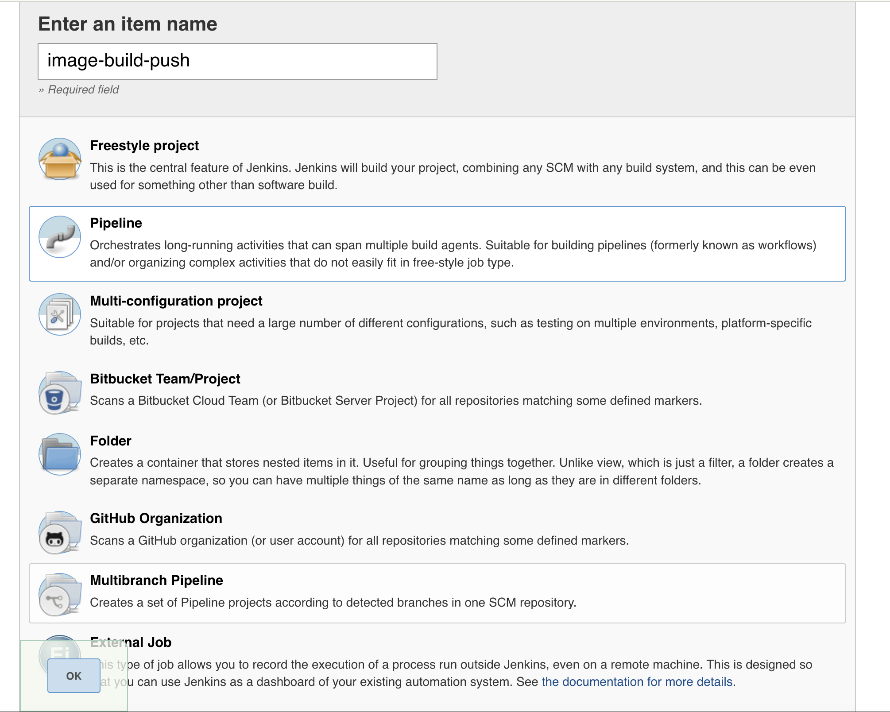
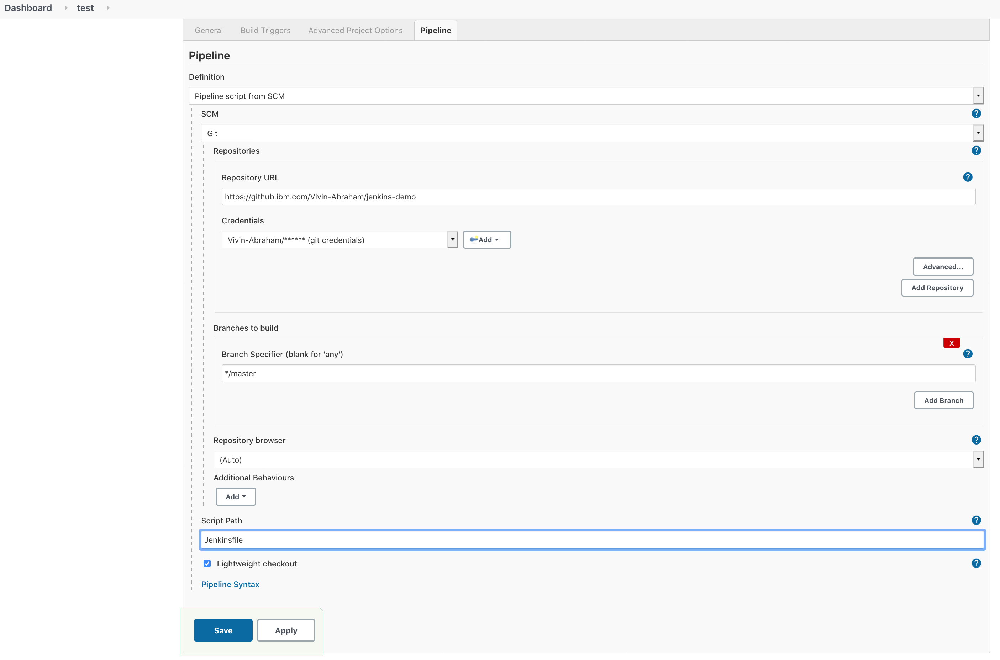
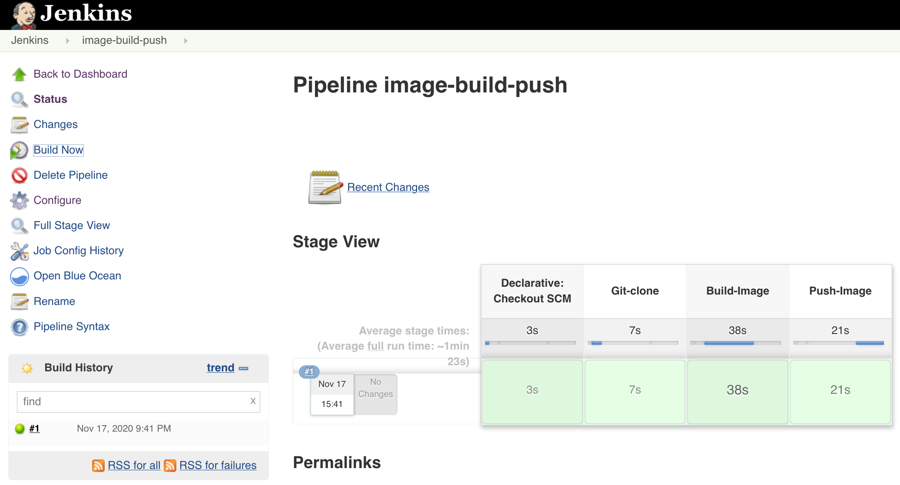
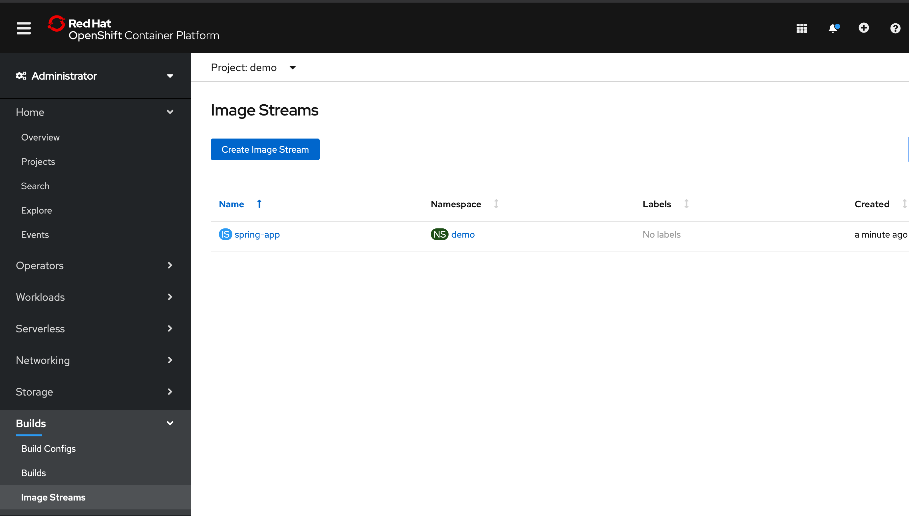

# jenkins-demo

PRE-REQ: 
  1) You need to have docker running on the Jenkins server. 

NOTE: OCP registry and project are hard coded at the moment. 

### Running Jenkins as a docker container

For demo purpose we have an instance of jenkins running on our local machine as a docker container. 

1. We am using ```liatrio/jenkins-alpine``` image which already has docker installed on it. 
   we need to run the container with mounted docker daemon. Run the following command from your terminal

```docker run -p 8080:8080 -v /var/run/docker.sock:/var/run/docker.sock liatrio/jenkins-alpine```

NOTE: The docker daemon running on host machine must be compatible with docker client running in Jenkins container. 
check the version of the host with docker --version and install the appropriate version of docker client inside the Jenkins container.

2. To see the jenkins instance go to ```http://localhost:8080/```

#### Setting up Jenkins 

We need to add our OCP and github credentials to jenkins before we can trigger our pipeline. 

##### Add OCP and Github credentials

1. From Jenkins homepage click on credentials 
 
   

2. credentials -> Add credentials
   
    

3. Fill the information.  
   To get the token for OCP switch over to OCP console and click on ```copy login command``` 
   
    
    In the screenshot below we are adding credentials for OCP. Take a note of what you add as the "ID" as you will be   referencing it in the Jenkinsfile.
    
   
    
4. In the screenshot below we are adding credentials for github. 

    
    
#### Create and trigger Jenkins pipeline 
1. From Jenkins homepage click on add "new-item" which will take you to the page where you can create a pipeline. 
    Give a name and select pipeline option and click ok.
    
    

2. Click on the advanced project options and from SCM select the repo where you have stored your Jenkinsfile, select the github credential you added earlier, select the branch and and click save.

   

3. Fom the pipeline you created click on "Build Now" to start your pipeline build 
   
   Below screenshot shows an example of a successful build. 

    

4. Switch over to OCP console to see the pushed application image. In the screenshot below we are checking image stream in ```demo``` project. 

    


